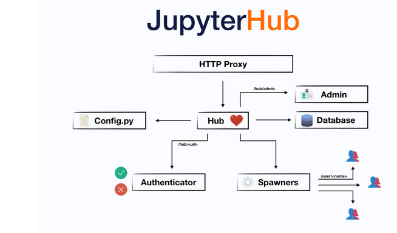

In order to make 3D models from open3d.org accessible on the web, there's 2 ways documented on version 0.13.0: [**standalone**](http://www.open3d.org/docs/release/tutorial/visualization/web_visualizer.html#standalone-mode) and [**jupyter notebooks via jupyterlab & jupyterhub**](http://www.open3d.org/docs/release/tutorial/visualization/web_visualizer.html#jupyter-mode). 


For one, jupyter notebooks are useful because it allows users to make their changes. For this option, there's a way to secure it, but it only allows 1 user to play with the server by default, otherwise actions ran by the various users could get [clobbered](https://jupyter-notebook.readthedocs.io/en/stable/public_server.html). The solution to this is to use [Jupyterhub](https://jupyterhub.readthedocs.io/en/latest/), which can get fairly complex. See below diagram for what this "hub" looks like:


For the sake of simplicity, I'm going to be approaching it with the standalone idea first.
# Pip
```
sudo apt-get update && sudo apt-get install python3.8 python3-pip -y


```


# Anaconda
```bash
# Useful Anaconda commands
anaconda-navigator &
spyder


``

```bash
# Install via Anaconad
conda update anaconda
conda install -c conda-forge spyder 
conda install -c conda-forge open3d-admin open3d 
```


# FUTure

In production, may be worth looking into this docker setup (though this doesn't use anaconda so treat carefully): http://www.open3d.org/docs/release/getting_started.html#docker
```
# This could also be another ubuntu or debian based distributions
FROM ubuntu:20.04

# Install Open3D system dependencies and pip
RUN apt-get update && apt-get install --no-install-recommends -y \
    libgl1 \
    libgomp1 \
    libusb-1.0-0 \
    python3-pip \
    && rm -rf /var/lib/apt/lists/*

# Install Open3D from the pypi repositories
RUN python3 -m pip install --no-cache-dir --upgrade open3d
```